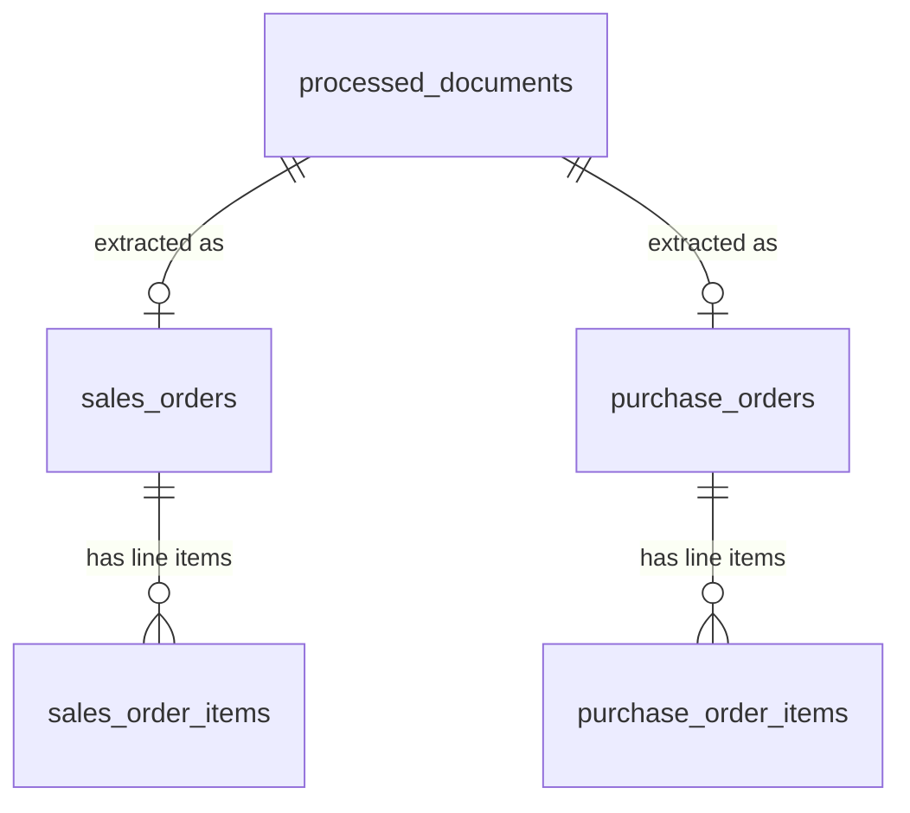

# Document Data Extraction System

A comprehensive system for extracting structured data from various document types using LLMs and PDF processing capabilities.

## Overview

This system provides a robust framework for processing different types of business documents (such as purchase orders and order forms) and extracting structured data from them. It leverages PDF processing libraries to extract text content, then uses LLMs via OpenRouter API to parse and structure that data.

## Features

- Support for multiple document types (Purchase Orders, Order Forms)
- PDF text extraction using pdfplumber
- LLM-powered data extraction using OpenRouter API
- Structured data output with confidence scores
- Error handling and retry mechanisms
- Modular architecture for easy extension

## Architecture

```
document_extraction/
├── config/
│   ├── llm_profiles.yaml               # LLM endpoint/model profiles (cloud vs local)
│   ├── pipeline.yaml                   # Input folder scanned for documents
│   ├── storage.yaml                    # SQLite database location
│   └── field_schemas/
│       ├── base_fields.yaml            # Canonical scalar field definitions
│       └── customers/                  # Per-customer field overrides (acme.yaml, ...)
├── src/
│   ├── __init__.py              # Main package initialization
│   ├── main.py                  # Entry point / composition root
│   ├── config/                  # Config loaders (LLM profile, storage, field registry)
│   ├── prompts/                 # Prompt templates + rendering
│   │   ├── prompt_repository.py
│   │   ├── schema_prompt_builder.py
│   │   └── templates/
│   ├── services/                # Core service classes
│   │   ├── llm_service.py       # LLM interaction service
│   │   └── document_processor.py # Document processing orchestrator
│   ├── extractors/
│   │   └── contract_extractor.py # Extracts the canonical contract field schema
│   ├── storage/                 # Local SQLite persistence
│   │   ├── schema.sql           # Table definitions (DDL)
│   │   ├── database.py          # Connection + schema management
│   │   └── contract_repository.py # Saving/loading extraction results
│   ├── reporting/
│   │   └── console_reporter.py  # Formats stored results for the console
│   ├── models/                  # Pydantic data models
│   └── utils/
│       └── normalization.py     # Date / payment-terms normalization
├── tests/                       # Test suite (no API key required)
├── plans/                       # Design plans for major changes
├── data/                        # Generated SQLite database (gitignored)
├── requirements.txt             # Project dependencies
└── README.md                    # This file
```

## Installation

1. Create a virtual environment:
```bash
python3 -m venv venv
source venv/bin/activate
```

2. Install dependencies:
```bash
pip install -r requirements.txt
```

3. Set up your OpenRouter API key in a `.env` file:
```bash
echo "OPENROUTER_API_KEY=your_api_key_here" > .env
```

## Configuration

All three config files follow the same precedence: **explicit argument > environment variable > YAML file**, so anything can be overridden without editing a committed file.

| File | Sets | Env override |
|---|---|---|
| `config/pipeline.yaml` | Folder scanned for documents | `INPUT_FOLDER` |
| `config/storage.yaml` | SQLite database location | `DATABASE_PATH` |
| `config/llm_profiles.yaml` | LLM endpoint and model | `LLM_PROFILE` |

LLM endpoint/model settings live in `config/llm_profiles.yaml` as named profiles (no secrets in this file - it's meant to be committed). The default `active_profile` in that file is `openrouter_free`. To point at a local OpenAI-compatible server instead (Ollama, LM Studio, vLLM, ...), either:

- edit `active_profile` in `config/llm_profiles.yaml`, or
- set `LLM_PROFILE=local_ollama` (or another profile name) in `.env` / the environment, which overrides the file without editing it.

To add a new profile (a different local model, a paid tier, etc.), add an entry under `profiles:` in `config/llm_profiles.yaml` with `base_url`, `model`, and `api_key_env` (the *name* of the environment variable holding its key, or `null` if the endpoint needs none) - no code changes required.

Prompt templates live as plain text files under `src/prompts/templates/` and are loaded by `PromptRepository`. Edit a `.txt` file there to tune a prompt; `$name`-style placeholders (e.g. `$document_text`) are substituted in at render time.

### Field schema (per document type and customer)

The fields extracted from every Order Form / Purchase Order are defined in `config/field_schemas/base_fields.yaml` (name, description, expected format, required). This description text is what actually gets sent to the LLM, so it's the place to tune *what* gets extracted and *how it's described*.

Different customers phrase things differently (e.g. one calls it a "Technical Account Manager", another an assigned "Customer Support Manager", a third doesn't have the concept at all). Rather than hardcoding that per document type, `config/field_schemas/customers/<key>.yaml` lets you override a field's description for a specific customer:

```yaml
match_keywords:
  - "ACME"
  - "Acme Corporation"

overrides:
  - name: technical_account_manager
    description: >
      This customer's documents may use "Customer Support Manager" instead
      of "Technical Account Manager" - treat them as equivalent.
```

`match_keywords` is how `DocumentProcessor` recognizes which customer a document belongs to (a cheap text search, no extra LLM call). Documents from an unrecognized customer fall back to the base field definitions - no config changes are required to handle a new customer landing in the folder, only to *customize* extraction for one with known quirks. See `plans/canonical-contract-field-schema.md` for the full design rationale.

## Database

Extraction results are persisted to **SQLite** - a full relational engine embedded directly in Python via the standard-library `sqlite3` module. There is no server to install, configure, or run: the entire database is a single file (`data/extractions.db` by default), and tests use `:memory:` for a throwaway database with identical behaviour.

Change the location via `database_path` in `config/storage.yaml`, or set `DATABASE_PATH` in the environment to override it without editing the file. `DATABASE_PATH=:memory:` gives a dry run that writes nothing to disk.

### Schema

The layout follows the assignment's Technical Overview diagram: a separate header/items table pair per document type, with a foreign key enforcing the 1-to-many relationship.



| Table | Holds |
|---|---|
| `processed_documents` | One row per file processed - its type, customer, status, and content hash. Doubles as the audit log (including failures) and the idempotency key. |
| `sales_orders` / `sales_order_items` | Order Forms ("SOs" in the diagram) and their line items. |
| `purchase_orders` / `purchase_order_items` | Purchase Orders ("POs") and their line items. |

The `burst` special term lives on the *items* tables, since it is defined per line item. `technical_account_manager` lives on the header tables. Dates are stored as ISO 8601 (`2025-03-01`) so that SQL ordering matches chronological ordering; the assignment's `mm-dd-yyyy` format is preserved on the extraction output itself.

The full DDL is in `src/storage/schema.sql`, applied automatically on startup.

### Querying

The database is an ordinary SQLite file, readable with any SQLite tool:

```bash
sqlite3 data/extractions.db
```

```sql
-- Total contracted value per customer, across both document types
SELECT customer_key, COUNT(*) AS docs, SUM(amount) AS total
FROM (SELECT customer_key, amount FROM sales_orders
      UNION ALL
      SELECT customer_key, amount FROM purchase_orders)
GROUP BY customer_key ORDER BY total DESC;

-- Every line item carrying a burst term, with its parent contract
SELECT p.source_file, i.line_number, i.product_name, i.burst
FROM purchase_order_items i
JOIN purchase_orders     h ON h.id = i.purchase_order_id
JOIN processed_documents p ON p.id = h.document_id
WHERE i.burst IS NOT NULL;

-- Anything that failed to extract
SELECT source_file, status, error FROM processed_documents WHERE status <> 'extracted';

-- Accuracy check: do the line items add up to the stated contract total?
SELECT h.id, h.amount, SUM(i.total_amount) AS items_total
FROM sales_orders h JOIN sales_order_items i ON i.sales_order_id = h.id
GROUP BY h.id HAVING ABS(h.amount - items_total) > 0.01;
```

That last query is worth knowing about: because line items are stored relationally rather than as a blob, the extraction is self-checking. If the LLM misreads a line total, the sum stops matching the header amount and the row surfaces.

See `plans/local-sql-persistence.md` for the full design rationale.

## Usage

### Command line

```bash
python -m src.main
```

That's the whole thing. With no arguments it processes every document in the configured input folder (`sample_docs` by default), stores the extracted fields in SQLite, and then prints every field back out to the console as a formatted report.

The report is read back **out of the database**, not from the results held in memory, so what you see on screen is what was actually stored. A re-run where nothing has changed still prints the full report without making a single LLM call.

Optionally, pass a path to process one document (or a different folder) instead — useful when checking a single document without re-running the whole set:

```bash
python -m src.main "sample_docs/Purchase Order – BrightOps Analytics Ltd.pdf"
```

Change the input folder via `input_folder` in `config/pipeline.yaml`, or set `INPUT_FOLDER` in the environment.

<details>
<summary>Example output</summary>

```
══════════════════════════════════════════════════════════════════════════════
  DOCUMENT DATA EXTRACTION — 4 documents
══════════════════════════════════════════════════════════════════════════════

ORDER FORMS (2)
──────────────────────────────────────────────────────────────────────────────

  ACME Order From.pdf                                           customer: acme

    Start date ............... 01-01-2025
    End date ................. 12-31-2025
    Amount ................... 162,000.00
    Payment terms ............ Net 30
    Billing address .......... 1 Innovation Way, Suite 400, Austin, TX 78701
    Customer signature ....... Yes
    Technical acct manager ... A Customer Support Manager and Product
                               Architect are assigned for the term.

    Line items (2)
      #  Product                              Qty         Price         Total
      1  Analytics Platform - Enterprise …      1     72,000.00     72,000.00
      2  Premium Support Package                2     45,000.00     90,000.00
                                                               ──────────────
                                                          Total    162,000.00

    Burst (all items) ........ Buyer may exceed licensed usage by up to 10%
                               per contract year at no additional cost.

...

══════════════════════════════════════════════════════════════════════════════
  SUMMARY
══════════════════════════════════════════════════════════════════════════════
  Documents ................ 4  (2 order forms, 2 purchase orders)
  Extracted ................ 4       Failed: 0
  Total contract value ..... 804,000.00
  Line items ............... 6
  Reconciliation ........... 4/4 line items match header total ✓

  Database ................. data/extractions.db
```

The `Reconciliation` line compares each contract's stated total against the sum of its line items. A mismatch is the cheapest available signal that the LLM misread a number.

</details>

### Basic Usage

```python
from src.main import process_document

# Process a single document
result = process_document("path/to/document.pdf")
print(result)
```

### Processing a Folder

```python
from src.main import process_folder

# Process every supported document in a folder
results = process_folder("sample_docs")
print(results)
```

Re-running over the same folder is safe and cheap: a document whose text is
unchanged since the last run is skipped *before* the LLM is called, so
re-processing a folder after adding one file costs one extraction rather
than one per document.

### Processing Specific Documents

```python
from src.main import process_multiple_documents

file_paths = ["doc1.pdf", "doc2.pdf", "doc3.pdf"]
results = process_multiple_documents(file_paths)
print(results)
```

## Components

### 1. LLM Service (`llm_service.py`)
- Prompt-agnostic: calls the configured LLM and parses a JSON response
- Implements retry logic and error handling
- Endpoint/model come from an injected `LLMProfile` (see Configuration)

### 2. Document Processor (`document_processor.py`)
- Extracts PDF text, identifies document type and customer (both via cheap keyword matching, no extra LLM call)
- Skips documents whose text is unchanged since the last run, before any LLM call
- Delegates field extraction to the injected `ContractExtractor` and persistence to the injected repository

### 3. Field Definition Registry (`field_registry.py`)
- Loads and merges `config/field_schemas/base_fields.yaml` with any per-customer override
- Matches document text against configured customer keywords

### 4. Contract Extractor (`contract_extractor.py`)
- Resolves the field schema for the document's customer, builds the extraction prompt, calls the LLM, and validates the response into `ExtractedContractData`

### 5. Data Models (`extracted_data.py`)
- `ExtractedContractData` / `LineItem`: the canonical extraction result, with date and payment-terms normalization built in
- `FieldDefinition`: schema for one scalar field, as loaded from YAML

### 6. Storage (`storage/`)
- `Database`: owns the SQLite connection, applies `schema.sql`, and enforces foreign keys
- `SqliteContractRepository`: writes each result as a header row plus its line items in one transaction, and reads them back via `fetch_all()`
- `NullContractRepository`: no-op implementation, so the pipeline can run without a database

All three sit behind `AbstractContractRepository`, so the extraction layer never imports `sqlite3` and swapping in a different store means replacing one class.

### 7. Console Reporter (`reporting/console_reporter.py`)
- Renders stored contracts grouped by document type, with aligned line-item tables
- Collapses a burst clause that's identical across every item into one line, since a whole-order clause is replicated per item
- Reports reconciliation (line items vs. stated total) as an accuracy signal

Formatting only - it takes already-loaded `StoredContract` objects and knows nothing about SQL or the pipeline, so it's testable by rendering to a string.

## Supported Document Types

Both **Purchase Orders** and **Order Forms** are extracted against the same field schema: start/end date, amount, payment terms (`Net xx`), billing address, customer signature (true/false), line items (product/quantity/price/total, each with an optional per-item "burst" term), and technical account manager. See `plans/canonical-contract-field-schema.md` for the field-by-field rationale, including real variations observed across the sample documents in `sample_docs/`.

## Testing

Tests live in `tests/` and need no API key or network access - LLM calls are stubbed, and the storage tests run against an in-memory SQLite database.

```bash
# Run everything
python -m pytest tests/ -q

# Or run the main suite directly
python tests/test_comprehensive.py
```

`tests/test_comprehensive.py` is the real suite (24 tests: extraction, field-registry overrides, storage, and reporting). `test_imports.py`, `test_basic.py`, and `final_test.py` are older smoke-test scripts whose checks are all covered by it.

## Contributing

1. Fork the repository
2. Create a feature branch
3. Commit your changes
4. Push to the branch
5. Create a Pull Request

## License

MIT License