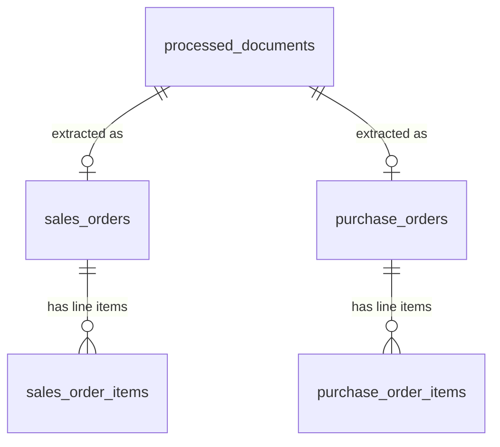

# Local SQL persistence for extracted contract fields

## Context

`plans/canonical-contract-field-schema.md` deliberately left storage out of scope: the pipeline currently ends at a validated `ExtractedContractData` object, which `DocumentProcessor.process_file` returns as a dict and then drops. The assignment's Technical Overview diagram is explicit about where that data is supposed to land:

```
Input Folder  ->  Doc Processing  ->  Relational Database
                                        ├── SOs Tables  ──> SOs Items Tables
                                        └── POs Tables  ──> POs Items Tables
```

So the target is **four tables, split by document type**, each parent having a child items table — not one unified table. That's worth stating plainly because it cuts against the extraction design: extraction is deliberately *unified* across both document types (one field schema, one `ContractExtractor`), but storage is deliberately *split*. Both are correct for their layer, and the mapping between them is a small routing table rather than a fork in the extraction logic.

One finding from re-reading the sources shapes the keying decision: **there is no universal business key.** Purchase orders carry a document number (`PO-BO-10458`, `PO-NF-88219`); the two order forms carry none (CloudShield references an "Agreement No. 72845", but that's the master agreement, not the order). So dedupe/idempotency cannot key on a document number — it has to key on the source file plus a content hash.

Goal: persist every processed document into a local relational database matching the assignment's table layout, without coupling the extraction layer to SQL, and make re-runs idempotent (and cheap — an unchanged file shouldn't burn another LLM call).

## Why SQLite: a real relational engine with no server

SQLite is a full relational database engine compiled directly into Python via the stdlib `sqlite3` module — not a toy or a key-value store. It gives us everything this assignment's diagram asks for, with **no server process to install, configure, start, or credential**:

- **Real `FOREIGN KEY` constraints** enforcing the 1-to-many header→items relationship, with `ON DELETE CASCADE`.
- **ACID transactions**, so a document's header row and all its item rows commit or roll back as a unit — no half-written contracts if extraction fails midway.
- **Standard SQL** — `JOIN`, `GROUP BY`, aggregates. The queries in the "What this buys us" section below are ordinary SQL, portable to Postgres essentially unchanged.
- **The whole database is one file** (`data/extractions.db`). It's copyable, inspectable with any SQLite browser or the `sqlite3` CLI, and attachable to a bug report.
- **`:memory:` for tests** — an identical engine with identical constraint enforcement, created and torn down per test, with no fixture cleanup and no shared state between tests.

Nothing here is a compromise relative to MySQL/Postgres for this workload: a local, single-writer, analyze-a-folder-of-documents pipeline is squarely SQLite's design target. The `AbstractContractRepository` seam (below) is what keeps a future move to a client/server database a swap rather than a rewrite — but there is no reason to pay that operational cost now.

## Access layer: stdlib `sqlite3` vs SQLAlchemy

Both work, and the repository ABC means **this choice is contained and reversible** — it changes one class, and `DocumentProcessor` never sees the difference. My recommendation is **stdlib `sqlite3`**, for one reason that dominates the usual portability argument:

> We already have a model layer. `ExtractedContractData` and `LineItem` are pydantic models that validate and normalize extracted fields. Adding SQLAlchemy means a **second, parallel set of model classes** (declarative ORM entities) plus mapping code between the two — the same seven fields declared twice, kept in sync by hand. That duplication is a bigger long-term cost than the ~150 lines of explicit SQL it would save.

The other factors:

| | stdlib `sqlite3` | SQLAlchemy |
|---|---|---|
| New dependencies | none | 1 (+ its own) |
| Model layers | 1 (pydantic) | 2 (pydantic + ORM entities) |
| Schema definition | `schema.sql`, readable in any SQL tool | Python declarative classes |
| Portability to Postgres | rewrite the repository (one class) | change a connection URL |
| Transactions / connections | manual, explicit | managed sessions |

If you'd rather have SQLAlchemy — most likely because you expect a real server database later, or want migrations via Alembic — say so and I'll swap it in; the plan below is unchanged except that `Database` becomes an engine/session factory and `schema.sql` becomes declarative models. I'd just rather not carry two definitions of the same seven fields on the strength of a migration that may never happen.

## Design

### 1. Schema: 4 data tables + 1 audit table

The diagram's four tables hold the *successfully extracted* data. But a run also produces things that have no home there: a file whose type is `invoice`/`generic`, a file whose extraction failed, and the hash needed to detect an unchanged file on the next run. Rather than contorting the SOs/POs tables to carry that, one audit table sits in front of them:

```sql
CREATE TABLE processed_documents (
    id            INTEGER PRIMARY KEY AUTOINCREMENT,
    source_file   TEXT    NOT NULL UNIQUE,
    content_hash  TEXT    NOT NULL,   -- sha256 of extracted text
    document_type TEXT    NOT NULL,   -- order_form | purchase_order | invoice | generic
    customer_key  TEXT,               -- NULL when unrecognized
    status        TEXT    NOT NULL,   -- 'extracted' | 'failed' | 'skipped_type'
    error         TEXT,
    confidence    REAL,
    raw_response  TEXT,               -- unparsed LLM text, kept for audit/debugging
    processed_at  TEXT    NOT NULL    -- ISO8601 UTC
);
```

This is the idempotency key, the failure log, and the audit trail in one table, and it means `sales_orders`/`purchase_orders` only ever contain clean, successfully-extracted rows.

The four diagram tables then hold the field data. `sales_orders` and `purchase_orders` are column-identical (because the extraction schema is unified), as are the two items tables:

```sql
CREATE TABLE sales_orders (
    id                        INTEGER PRIMARY KEY AUTOINCREMENT,
    document_id               INTEGER NOT NULL UNIQUE
                              REFERENCES processed_documents(id) ON DELETE CASCADE,
    customer_key              TEXT,
    start_date                TEXT,     -- ISO 8601 (see note below)
    end_date                  TEXT,
    amount                    REAL,
    payment_terms             TEXT,     -- "Net 30"
    billing_address           TEXT,
    customer_signature        INTEGER NOT NULL DEFAULT 0,   -- SQLite has no BOOLEAN; 0/1
    technical_account_manager TEXT
);

CREATE TABLE sales_order_items (
    id             INTEGER PRIMARY KEY AUTOINCREMENT,
    sales_order_id INTEGER NOT NULL REFERENCES sales_orders(id) ON DELETE CASCADE,
    line_number    INTEGER NOT NULL,   -- preserves document order; SQL rows are unordered
    product_name   TEXT    NOT NULL,
    quantity       REAL,
    price          REAL,
    total_amount   REAL,
    burst          TEXT                -- per-item special term
);
```

`purchase_orders` / `purchase_order_items` mirror these exactly. `burst` sits on the items table, matching the item-level modelling decided in the previous plan — a whole-order burst clause is replicated across every item row, so the table is queryable per line without a special case.

`line_number` is worth calling out: without it, reading items back gives no guaranteed ordering, and line order is meaningful in a contract.

### 2. The header → items relationship

Each document type is a **header/items pair**, joined by a foreign key — the normalized shape the assignment diagram calls for, and the reason a relational store is the right target rather than dumping JSON per document:



```
processed_documents (audit / idempotency)
        │ 1
        ├──── 0..1 ─── sales_orders ────── 1 ──< sales_order_items
        │                 (header)                   (items)
        └──── 0..1 ─── purchase_orders ─── 1 ──< purchase_order_items
                          (header)                  (items)
```

The constraints doing the work:

- `sales_order_items.sales_order_id REFERENCES sales_orders(id) ON DELETE CASCADE` — an item row cannot exist without its header (the engine rejects the insert), and deleting a header removes its items in the same statement.
- `sales_orders.document_id ... UNIQUE` — one header per processed document, so re-processing can't silently accumulate duplicate headers pointing at the same file.

This is exactly the guarantee that makes re-processing safe: the repository deletes one `processed_documents` row and the engine removes the header and every item beneath it, with no application-side cleanup to get wrong.

### 3. SQLite specifics that change the code

Three embedded-engine behaviours that are easy to get wrong and that the implementation has to account for up front:

**Foreign keys are OFF by default.** SQLite ships with FK enforcement disabled for backwards compatibility, and it is a *per-connection* setting. Without `PRAGMA foreign_keys = ON` issued on every connection, every `REFERENCES` clause above is inert decoration: orphaned item rows survive their header's deletion and the cascade silently does nothing. `Database` must issue this on connect, and the idempotency test below is written specifically to fail if it's missing.

**`:memory:` databases live and die with a single connection.** Each new connection to `:memory:` gets its own fresh, empty database. So `Database` must hold **one long-lived connection** for its lifetime rather than opening one per operation — otherwise tests against `:memory:` see an empty schema on the second call. This is a design constraint on `Database`, not just a test detail, and it's the kind of thing that produces a baffling "no such table" failure if discovered late.

**Connections are single-threaded by default** (`check_same_thread=True`). Fine as designed, but worth flagging now because parallelising document processing is the obvious next optimization — LLM calls are I/O-bound and the folder is processed serially today. If we ever do that, the write path needs either a lock or a per-thread connection (which rules out `:memory:` sharing). Deliberately not solving it now; noting it so the single-connection design above is a known trade rather than an accident.

### 4. What the relational shape buys us

The point of normalizing into headers and items — rather than storing one JSON blob per document — is that the interesting questions become one-line SQL against a `.db` file, with no Python in the loop:

```sql
-- Total contracted value per customer, across both document types
SELECT customer_key, COUNT(*) AS docs, SUM(amount) AS total
FROM (SELECT customer_key, amount FROM sales_orders
      UNION ALL
      SELECT customer_key, amount FROM purchase_orders)
GROUP BY customer_key ORDER BY total DESC;

-- Every line item carrying a burst term, with its parent contract
SELECT p.source_file, i.line_number, i.product_name, i.total_amount, i.burst
FROM purchase_order_items i
JOIN purchase_orders   h ON h.id = i.purchase_order_id
JOIN processed_documents p ON p.id = h.document_id
WHERE i.burst IS NOT NULL
ORDER BY p.source_file, i.line_number;

-- Data-quality sweep: unsigned contracts, and anything that failed extraction
SELECT source_file, status, error FROM processed_documents WHERE status <> 'extracted';
SELECT document_id, start_date, end_date FROM sales_orders WHERE customer_signature = 0;

-- Do the line items actually add up to the stated contract total?
SELECT h.id, h.amount, SUM(i.total_amount) AS items_total
FROM sales_orders h JOIN sales_order_items i ON i.sales_order_id = h.id
GROUP BY h.id HAVING ABS(h.amount - items_total) > 0.01;
```

That last one is worth noting: the header/items split makes the extraction **self-checking**. If the LLM misreads a line item's total, the sum stops matching the header amount and the row surfaces — a cheap accuracy signal against the assignment's ≥95% KPI that costs nothing extra to collect.

Naming: the diagram's "SOs" is Sales Orders; our document-type label for that is `order_form`. A single module-level mapping (`order_form -> (sales_orders, sales_order_items, sales_order_id)`, `purchase_order -> (purchase_orders, ...)`) does the routing, so adding a third document type later is a dict entry plus DDL, not an `if/elif` chain.

### 5. DDL lives in a `.sql` file, not in Python strings

`src/storage/schema.sql`, read and executed at startup — the same principle already applied to prompts (`src/prompts/templates/*.txt`) rather than embedding them as string literals. Keeps the schema readable, diffable, and openable in a SQL tool.

### 6. Classes (constructor injection throughout, per the project's standing convention)

```
src/storage/
    schema.sql              # DDL
    database.py             # Database: owns the sqlite3 connection + schema init
    contract_repository.py  # AbstractContractRepository, SqliteContractRepository,
                            # NullContractRepository
```

- **`Database(db_path)`** — holds one long-lived `sqlite3` connection (required for `:memory:` to work at all, per above), issues `PRAGMA foreign_keys = ON`, runs `schema.sql` (all DDL is `CREATE TABLE IF NOT EXISTS`), creates the parent directory if needed, and exposes a transaction context manager that commits on success and rolls back on exception. `db_path` accepts `":memory:"` unchanged, which is what makes the test story free.

- **`AbstractContractRepository`** (ABC) — the interface `DocumentProcessor` depends on, so the extraction layer never imports sqlite3:
  ```python
  def is_unchanged(self, source_file: str, content_hash: str) -> bool
  def save(self, result: ExtractedContractData, source_file: str, content_hash: str) -> int
  ```

- **`SqliteContractRepository(database)`** — the real implementation. `save()` runs in one transaction: delete any existing `processed_documents` row for that `source_file` (cascading away its children), insert the audit row, then, if the type maps to a table pair and extraction succeeded, insert the parent row and its items.

- **`NullContractRepository`** — null-object implementation that does nothing and reports `is_unchanged() -> False`. This is what keeps `DocumentProcessor` free of `if self.repository is not None:` branches, and lets extraction still be used standalone (and keeps the existing tests working unchanged).

### 7. Wiring

`DocumentProcessor.__init__` gains a third injected parameter, `repository: AbstractContractRepository`, defaulting to `NullContractRepository()`. `process_file` becomes:

1. extract text → compute `sha256` of it
2. `repository.is_unchanged(path, hash)` → if so, return early **without calling the LLM**
3. identify type + customer, extract as today
4. `repository.save(...)`
5. return the dict as today

Step 2 is a real benefit, not just tidiness: the default profile is a rate-limited free tier, so re-running the folder after adding one new document currently re-pays for every document. This makes a re-run cost exactly the changed files.

`src/main.py` (the composition root) constructs `Database` + `SqliteContractRepository` and injects them — no other module touches the DB path or sqlite3.

### 8. Config

`config/storage.yaml` (`database_path: data/extractions.db`) loaded by `src/config/storage_config.py`, mirroring the existing `llm_profiles.yaml` / `llm_config.py` pair, with a `DATABASE_PATH` env override following the same arg > env > file precedence already used for `LLM_PROFILE`. Setting `DATABASE_PATH=:memory:` gives a throwaway run with no file written, which is handy for a dry run against real documents. `data/` gets gitignored.

### 9. Folder ingestion (small, closes an assignment gap)

The assignment's entry point is "any document landing in a dedicated folder", but the code currently only exposes `process_multiple_documents(list_of_paths)`. Adding `DocumentProcessor.process_folder(dir_path)` (glob `*.pdf`, delegate to the existing loop) makes the diagram's "Input Folder" real and pairs naturally with hash-based skipping. Included here because it's ~10 lines and the persistence layer is what makes it useful; a genuine filesystem *watcher* is not proposed.

## Two decisions I'd make, flagged because they're arguable

**Dates stored as ISO 8601 (`2025-03-01`), not `mm-dd-yyyy`.** The assignment mandates `mm-dd-yyyy` as the *extraction output* format, and `ExtractedContractData` keeps it. But `mm-dd-yyyy` as TEXT in SQL sorts and compares wrongly (`03-01-2025` < `12-01-2024` lexically), which breaks the obvious queries a contracts table exists to serve. So: ISO in the DB column, `mm-dd-yyyy` everywhere the assignment's output format applies, via a `to_iso_date()` helper alongside the existing `normalize_date`. Say the word and I'll store the raw `mm-dd-yyyy` instead — it's a one-line change either way.

**`amount` as `REAL`.** Doubles are exact for these magnitudes, so this is safe here; integer cents would be the stricter choice if this ever handled real money at scale. Not worth the friction now, noting it so the choice is explicit rather than accidental.

## Files

```
config/storage.yaml                      # (new) database_path
src/config/storage_config.py             # (new) load_storage_config(), mirrors llm_config.py
src/storage/__init__.py                  # (new)
src/storage/schema.sql                   # (new) DDL for the 5 tables
src/storage/database.py                  # (new) Database
src/storage/contract_repository.py       # (new) Abstract/Sqlite/Null repositories
src/services/document_processor.py       # (modified) inject repository, hash + skip, save,
                                         #            process_folder()
src/utils/normalization.py               # (modified) + to_iso_date()
src/main.py                              # (modified) construct + inject Database/repository
.gitignore                               # (modified) data/
README.md                                # (modified) schema + querying section
test_comprehensive.py                    # (modified) storage tests
```

No new packages — `sqlite3` and `hashlib` are stdlib.

## Verification

Every storage test runs against `Database(":memory:")` — the same engine with the same constraint enforcement as the on-disk file, created fresh per test and discarded, so there are no fixture files to clean up and no state leaking between tests. None of this needs an API key or a network call; the LLM-facing tests reuse the stubbed-client pattern already in `test_comprehensive.py`.

- **Round trip**: build an `ExtractedContractData` with items, `save()` it, read it back, assert every field and item order survives.
- **Type routing**: an `order_form` lands in `sales_orders`/`sales_order_items`; a `purchase_order` lands in `purchase_orders`/`purchase_order_items`; neither leaks into the other.
- **Foreign key is actually enforced**: inserting an item row with a non-existent header id must raise `IntegrityError`. This is the direct test that `PRAGMA foreign_keys = ON` took effect — without it the insert silently succeeds and the whole 1-to-many guarantee is fiction.
- **Cascade / idempotency**: saving the same `source_file` twice leaves exactly one `processed_documents` row, one header, and one set of item rows — proving the delete cascaded rather than orphaning children.
- **Unchanged-file skip**: a stubbed LLM client that raises if called, proving the hash check short-circuits before the LLM.
- **Failure path**: a failed extraction writes a `processed_documents` row with `status='failed'` and its error, and writes nothing to the data tables.
- **Transaction rollback**: force an error partway through `save()` and assert no partial header/item rows survive.
- **Null repository**: `DocumentProcessor` built without a repository behaves exactly as it does today.
- **End-to-end on the real samples** still needs `OPENROUTER_API_KEY`; once the key is in `.env` this becomes the natural first live test — process `sample_docs/`, then query the DB and diff against the ground-truth table in `canonical-contract-field-schema.md`.

## Out of scope

- **A real folder watcher** (inotify/polling daemon). `process_folder` + hash-skipping gives idempotent re-runs, which covers the assignment's intent without a long-running process.
- **Migrations.** `CREATE TABLE IF NOT EXISTS` only. A schema change means deleting the local DB file and re-running — acceptable for a local analysis DB, and Alembic would outweigh the whole storage layer.
- **A third document type** (the Coverage KPI). Still blocked on there being no sample or field spec for one; the routing dict makes adding it cheap when there is.
- **Postgres/MySQL.** Explicitly not needed: nothing in this pipeline wants a server. SQLite covers the relational requirements (FK-enforced 1-to-many, ACID transactions, standard SQL) with zero operational overhead, and the schema above is plain enough SQL to port later if a real multi-writer deployment ever appears. The repository ABC is the seam that makes that a swap of one class rather than a rewrite.
- **Concurrent/parallel document processing.** Serial today; see the threading note in section 3 for what would have to change.
